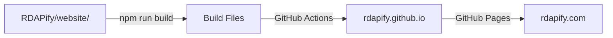

# 🌐 RDAPify Website

[](https://rdapify.com)
[](https://rdapify.github.io)
[](LICENSE)

This repository hosts the **built website** for [RDAPify](https://github.com/rdapify/RDAPify) on GitHub Pages.

## 🌐 Live Site

- **Production**: https://rdapify.com
- **GitHub Pages**: https://rdapify.github.io

## 📦 About This Repository

This repository contains **only the built static files** from the main RDAPify repository. It is automatically updated by GitHub Actions.

### ⚠️ Important Notice

**Do NOT edit files in this repository directly!**

All website source files are in the main repository:
- **Source Code**: https://github.com/rdapify/RDAPify/tree/main/website
- **Documentation**: https://github.com/rdapify/RDAPify/tree/main/docs

### Files You Can Edit Here

Only these files should be edited in this repository:
- ✅ `CNAME` - Custom domain configuration
- ✅ `README.md` - This file
- ✅ `LICENSE` - License file
- ✅ `CONTRIBUTING.md` - Contributing guidelines
- ✅ `.gitignore` - Git ignore rules

All other files are automatically generated and will be overwritten on the next deployment.

## 🔄 How It Works



### Deployment Flow

1. **Edit** files in `RDAPify/website/` or `RDAPify/docs/`
2. **Push** to main branch in RDAPify repository
3. **Build** - GitHub Actions builds the Docusaurus website
4. **Deploy** - Built files are pushed to this repository
5. **Serve** - GitHub Pages serves the site at rdapify.com

### Automatic Deployment

Deployment is triggered when:
- Changes are pushed to `main` branch
- Changes are made in `website/` or `docs/` directories
- Workflow is manually triggered

## 🛠️ Development

To work on the website, use the main repository:

```bash
# Clone the main repository
git clone https://github.com/rdapify/RDAPify.git
cd RDAPify/website

# Install dependencies
npm install

# Start development server (with hot reload)
npm start
# Opens at: http://localhost:3000

# Build for production
npm run build

# Serve production build locally
npm run serve
```

## 📁 Repository Structure

```
rdapify.github.io/
├── index.html          # Landing page (before full deployment)
├── 404.html            # Custom 404 page
├── robots.txt          # SEO configuration
├── CNAME               # Custom domain (rdapify.com)
├── .nojekyll           # Disable Jekyll processing
├── .gitignore          # Git ignore rules
├── README.md           # This file
├── LICENSE             # MIT License
├── CONTRIBUTING.md     # Contributing guidelines
└── [Built files]       # Automatically generated by Docusaurus
```

## 🚀 Current Status

### Before First Deployment
- ✅ Repository created
- ✅ CNAME configured
- ✅ Landing page ready
- ✅ 404 page ready
- ⏳ Waiting for first deployment from main repository

### After First Deployment
The repository will contain:
- 📄 Documentation pages
- 🎨 Assets (CSS, JS, images)
- 🔍 Search index
- 📊 Sitemap
- 🤖 robots.txt

## 🔗 Related Links

### Main Project
- **Repository**: https://github.com/rdapify/RDAPify
- **npm Package**: https://www.npmjs.com/package/rdapify
- **Issues**: https://github.com/rdapify/RDAPify/issues
- **Discussions**: https://github.com/rdapify/RDAPify/discussions

### Documentation
- **Setup Guide**: https://github.com/rdapify/RDAPify/blob/main/GITHUB_SETUP.md
- **Contributing**: https://github.com/rdapify/RDAPify/blob/main/CONTRIBUTING.md
- **Development**: https://github.com/rdapify/RDAPify/blob/main/DEVELOPMENT.md

## 🤝 Contributing

Want to contribute to the website?

1. **Fork** the main repository: https://github.com/rdapify/RDAPify
2. **Edit** files in `website/` or `docs/` directory
3. **Test** locally with `npm start`
4. **Submit** a pull request to the main repository

See [CONTRIBUTING.md](CONTRIBUTING.md) for more details.

## 📊 Statistics

- **Built with**: [Docusaurus](https://docusaurus.io/)
- **Hosted on**: GitHub Pages
- **Custom Domain**: rdapify.com
- **SSL**: Enabled (HTTPS)
- **CDN**: GitHub's global CDN

## 📄 License

MIT License - see [LICENSE](LICENSE) file for details.

---

<div align="center">

**[Website](https://rdapify.com)** • 
**[Documentation](https://rdapify.com/docs)** • 
**[GitHub](https://github.com/rdapify/RDAPify)** • 
**[npm](https://www.npmjs.com/package/rdapify)**

© 2025 RDAPify Contributors

</div>
